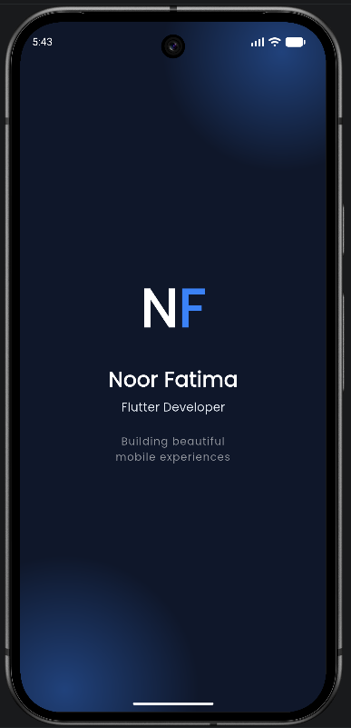
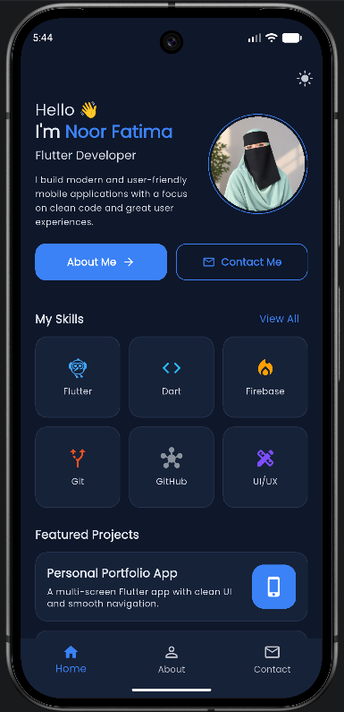
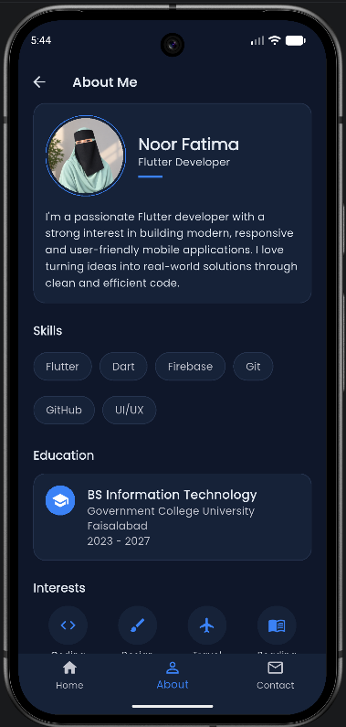
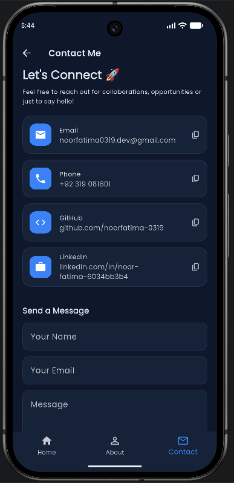

# Personal Portfolio App

A multi-screen personal portfolio mobile application built with Flutter, developed as my Week 1 internship task at **DawoodTech NextGen** — *Introduction to Mobile App Development & UI Fundamentals*.

**Live Demo:** https://noorfatima-0319.github.io/portfolio_app/
**GitHub Repository:** https://github.com/noorfatima-0319/portfolio_app

## Objective

This project demonstrates the foundations of mobile app development covered in Week 1: setting up a Flutter environment, building UI with widgets, creating responsive layouts, navigating between multiple screens, using reusable components, and applying basic state management.

## Screens

| Screen | Description |
|--------|-------------|
| **Splash** | Introduces the app with the developer's name and role, then automatically opens the Home screen. |
| **Home** | Main landing screen — profile photo, short bio, skills grid, and a featured projects section. |
| **About** | Detailed bio, skills, education, and interests. |
| **Contact** | Email, phone, GitHub and LinkedIn details (tap to copy), plus a message form with input validation. |

Navigation between screens uses a bottom navigation bar, with `IndexedStack` to switch between Home, About and Contact.

## Concepts Applied

- **Widgets & UI Components:** `Scaffold`, `AppBar`, `Card`, `ListTile`, `Chip`, `TextFormField`, custom widgets
- **Layouts:** `Row`, `Column`, `Stack`, `Wrap`, `Expanded`, `GridView`, built responsively with `LayoutBuilder`
- **Navigation:** Bottom navigation bar (Home / About / Contact) and `Navigator.pushReplacement` from Splash to the main app
- **State management basics:** `StatefulWidget` and `setState()` — used for the bottom navigation tab switching, the light/dark theme toggle, and the contact form
- **Reusable widgets:** `CustomButton`, `SkillCard`, `ProjectCard`, `ContactCard`, `InfoCard`, `SectionTitle`, `ProfileAvatar` — built once and reused across screens
- **Debugging & Hot Reload:** used throughout development to test UI changes quickly

## Project Structure

```
lib/
├── main.dart                 # App entry point, theme state
├── constants/
│   └── app_constants.dart    # All text content and data in one place
├── models/
│   ├── skill_model.dart
│   └── project_model.dart
├── screens/
│   ├── splash_screen.dart
│   ├── main_screen.dart      # Holds the bottom navigation
│   ├── home_screen.dart
│   ├── about_screen.dart
│   └── contact_screen.dart
├── theme/
│   └── app_theme.dart        # Light and dark theme definitions
└── widgets/
    ├── custom_button.dart
    ├── info_card.dart
    ├── section_title.dart
    ├── skill_card.dart
    ├── project_card.dart
    ├── profile_avatar.dart
    └── contact_card.dart
```
## Screenshots

| Splash | Home | About | Contact |
|--------|------|-------|---------|
|  |  |  |  |

## Technologies Used

- Flutter & Dart
- `google_fonts` package (for typography)

## Setup Instructions

1. Clone the repository:
```bash
   git clone https://github.com/noorfatima-0319/portfolio_app.git
   cd portfolio_app
```
2. Install dependencies:
```bash
   flutter pub get
```
3. Run the app:
```bash
   flutter run
```
Select an emulator, a connected device, or Chrome when prompted.

## Building the Web Version (used for the live demo)

```bash
flutter build web --release --base-href "/portfolio_app/"
```
The output in `build/web` is copied into the `docs` folder and served with GitHub Pages.

## Author

**Noor Fatima**
BS Information Technology, Government College University Faisalabad
[GitHub](https://github.com/noorfatima-0319) · [LinkedIn](https://www.linkedin.com/in/noor-fatima-6034bb3b4/)